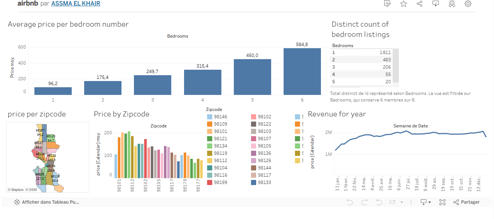

🏡 Airbnb Data Analysis with Tableau

In this project, I analyzed **Airbnb price trends by bedroom number and location** in Seattle, Washington, for the year 2016. The goal was to uncover insights into how factors like location and the number of bedrooms impact pricing and revenue patterns.

📊 Tableau Public Link
[👉 View the Dashboard Here](https://public.tableau.com/views/airbnb_17390468274790/Tableaudebord1?:language=fr-FR&publish=yes&:sid=&:redirect=auth&:display_count=n&:origin=viz_share_link)

📈 Dashboard Overview
The dashboard presents key metrics related to Airbnb listings in Seattle, based on five distinct sheets:
1. **Price per Zipcode (Bar Chart):** A bar chart comparing average prices per zip code for easier comparison. 
2. **Price per Zipcode (Map):** A geographical map visualizing average Airbnb prices across Seattle's zip codes.
3. **Revenue for the Year:** A time series line chart showing revenue trends week by week throughout 2016.
4. **Average Price per Bedroom:** Displays how prices vary depending on the number of bedrooms.
5. **Distinct Count of Bedroom Listings:** A table showing the number of listings by bedroom count.

All these sheets are combined into an interactive dashboard to provide clear insights into Airbnb pricing trends and listing distributions in Seattle.

##🌟 Dashboard Preview
(Here’s an overview of the interactive dashboard in action)

## 🚀 How to Use
- Open the `airbnb.twbx` file with Tableau Desktop or Tableau Public.
- Explore the data visualizations to analyze price trends, bedroom listings, and revenue patterns.

## 📊 Dataset
The dataset used for this project is publicly available on Kaggle:  
[🔗 View the Dataset Here](https://www.kaggle.com/datasets/airbnb/seattle)

## 📊 **Key Insights from the Analysis**

1️⃣ **Price per Zipcode (Bar Chart & Map)**
- **Observation:**  
  The average price per night varies significantly across Seattle's zip codes.  
  - Some zip codes like **98109** and **98121** show **higher average prices**, likely due to their proximity to downtown Seattle and popular tourist attractions.  
  - Conversely, areas like **98118** and **98178** have **lower average prices**, which could be attributed to their distance from the city center or fewer high-end properties.

- **Insight:**  
  **Location is a major factor influencing Airbnb pricing**. Hosts in central neighborhoods can charge higher rates due to better accessibility and local amenities.

2️⃣ **Average Price per Bedroom**
- **Observation:**  
  There's a clear upward trend: as the number of bedrooms increases, so does the average price.  
  - **1-bedroom listings** average around **96.2 USD**, while **6-bedroom properties** reach up to **584.8 USD**.  
  - The price doesn’t just increase linearly—it rises sharply with more bedrooms, showing a steep growth beyond 4 bedrooms.

- **Insight:**  
  **Larger properties cater to groups or families**, justifying the higher price. However, beyond 4 bedrooms, the price increase might also reflect luxury listings with premium features.

3️⃣ **Revenue for the Year (Time Series)**
- **Observation:**  
  The revenue curve shows **steady growth** from January to mid-year, peaking around **July-August** before slightly stabilizing.  
  - There’s a noticeable **dip towards the end of the year**, possibly due to seasonal variations post-holiday season.

- **Insight:**  
  **Summer months generate the highest revenue**, likely due to tourism peaks. Hosts could adjust their pricing strategies seasonally to maximize profits.

4️⃣ **Distinct Count of Bedroom Listings**
- **Observation:**  
  - **1-bedroom listings dominate** the market with over **1,800 listings**, followed by 2-bedroom units (~480 listings).  
  - Listings with **5 or 6 bedrooms** are extremely rare, totaling less than 30 combined.

- **Insight:**  
  **Seattle’s Airbnb market favors smaller apartments and condos**, reflecting urban housing trends. This also suggests potential for high-demand, niche pricing for large properties due to their scarcity.  
  Additionally, the **low number of 5-6 bedroom listings means less competition** for hosts offering such properties, allowing them to **set premium prices** and target large groups or families seeking spacious accommodations.

## 🚀 **Conclusion**
Through this analysis, it’s clear that **location, property size, and seasonality** are the key drivers of Airbnb pricing and revenue trends in Seattle. This project demonstrates how data visualization can uncover meaningful insights to inform business strategies for short-term rental markets.

